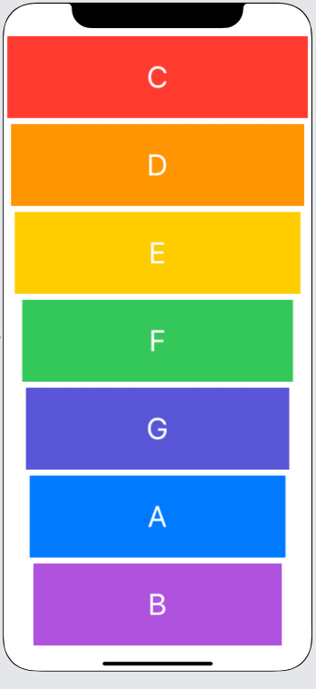

# Xylophone

## Challenges I Faced?

Understanding how sound is going to play in my application is quite challenging at this current point in time.

## How Did I Over Come Those Challenges? 

Collaboration with my peers gave me clearer understanding of how to play sound in my applications. Once I had a general idea of how to accomplish this feat, I began leveraging platforms like Google, YouTube, MDN docs, Stackoverflow, GitHub, online courses, and reference guides. Through my combined research on these platforms I was able to find the proper Swift methods and functions needed to complete the task and I programmed the Xylophone accordingly.

## What Did I Learn? 

* How to play sound using AVFoundation and AVAudioPlayer.
* How to understand Apple documentation. 
* How to use functions and methods in Swift.
* How to use Data types in Swift.
* How to use Swift loops.
* How to understand and use variable scope.
* How to understand and use the viewController lifecycle.
* How to handle errors in Swift.
* How to do code refactoring in Swift
* How to do Basic debugging in Swift

